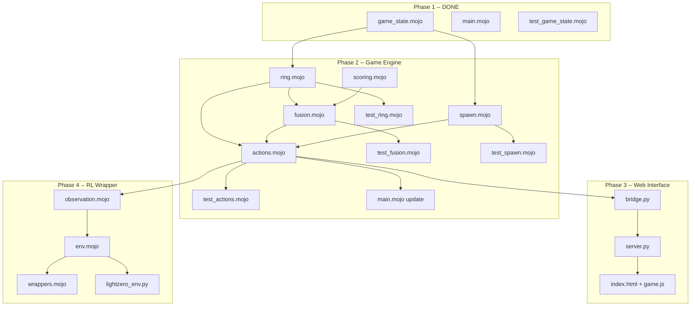

# old Nucleo -- Complete Implementation Plan

This document is a self-contained handoff plan for building the entire Nucleo game engine across all four phases. It assumes the implementing agent has no prior context beyond this file and the repository's `CLAUDE.md`.

---

## Repository Context

**Project:** Nucleo -- a circular-merge puzzle game engine in Mojo, inspired by Atomas.
**Organization:** Odyssey Therapeia (healthcare AI company, R&D in RL).
**Purpose:** (1) playable game, (2) RL-ready environment for Stochastic MuZero, (3) Mojo ecosystem contribution.
**Mojo version:** 0.26.2 on pixi 0.66.0, stable channel `https://conda.modular.com/max/`.

### What Already Exists (Phase 1 -- DONE)

- [pixi.toml](pixi.toml) -- project manifest with `mojo >=0.26.2`, tasks for build/run/test/format
- [.gitignore](.gitignore) -- standard Mojo/pixi ignores
- [src/game_state.mojo](src/game_state.mojo) -- `GameState` struct with `InlineArray[Int8, 18]` ring, `reset()`, `spawn_piece()`, `write_to()`
- [src/main.mojo](src/main.mojo) -- CLI entrypoint that creates a GameState and prints it
- [tests/test_game_state.mojo](tests/test_game_state.mojo) -- 5 passing tests (reset state, ring empty, current piece valid, spawn range, constants)

### Critical Mojo Syntax Rules (Mojo 0.26.2)

Every file MUST follow these -- they override any pretrained knowledge:

- `def` not `fn` (fn is deprecated; def does NOT imply raises)
- `comptime` not `alias` for compile-time constants
- `out self` in `__init_`_, `mut self` for mutating methods
- `var` not `let` (no let keyword)
- `Writable` / `write_to(self, mut writer: Some[Writer])` not `Stringable` / `__str__`
- Imports use `std.` prefix: `from std.testing import ...`, `from std.random import ...`
- `InlineArray[T, N]` for fixed-size arrays (T must be Copyable)
- `random_si64(min, max)` returns Int64 in [min, max] inclusive
- `random_float64(min, max)` returns Float64 in [min, max)
- Testing: `TestSuite.discover_tests[__functions_in_module()]().run()`
- No docstring literals inside struct bodies -- use comments above methods instead
- All test tasks use `-I src` flag for module resolution: `mojo run -I src tests/...`

---

## Game Mechanics Reference (Reverse-Engineered from Atomas)

### Board

- Circular ring, maximum 18 slots
- Game starts with 6 atoms (Hydrogen/Helium/Lithium range, values 1-3)
- Player holds one piece in their "hand" (center) each turn
- Game ends when ring has 18 elements and the next piece is not a special item that could reduce the count

### Element Encoding

- Positive Int8: regular element (1=H, 2=He, 3=Li, ... up to 118+)
- -1: Plus (Red Plus) -- fuses matching adjacent atoms
- -2: Minus (Electron) -- absorbs an atom from the ring
- -3: Black Plus (Dark Plus) -- fuses ANY two adjacent atoms
- 0: Empty slot

### Spawn Algorithm (Exact)

**Special items (rolled first via random_float64):**

- Plus: ~17% chance (guaranteed at least every 5 moves)
- Minus: ~5% chance (roughly every 20 moves)
- Black Plus: ~1.25% chance (1/80) ONLY when score > 750

**Regular elements:**

- Uniform random in `[max(1, M-4), max(1, M-1)]` where M = highest element on board
- Every 40 moves, the spawn range expands
- If atoms below the current spawn range exist on the board, they can still spawn with probability `1 / ring_size` (pity spawn)
- When highest_element <= 1, always spawn Hydrogen

### Plus Fusion (Chain Reaction)

When Plus is placed between two elements at positions left and right:

1. If `ring[left] == ring[right]` (matching): **simple reaction**
  - Result = `ring[left] + 1`
  - Remove left, Plus, right; insert result at Plus position
  - Score += `floor(1.5 * (Z + 1))` where Z = original atom value
2. After merge, check NEW neighbors of the result element:
  - If new left neighbor == new right neighbor: **chain reaction**
  - Let C = center (result), Y = outer matching atoms, r = reaction depth
  - If Y < C: `new_center = C + 1`, score += `floor(M * (C + 1))`
  - If Y >= C: `new_center = Y + 2`, score += `floor(M * (C + 1)) + 2 * M * (Y - C + 1)`
  - Where multiplier `M = 1 + 0.5 * r`
  - Continue recursively until neighbors don't match
3. Chain reactions check outward symmetrically from center
4. Ring is circular: index 0 is adjacent to index (ring_size - 1)
5. Plus favors counter-clockwise fusion when ambiguous

### Black Plus Fusion

- Same as Plus but can fuse ANY two adjacent atoms regardless of value
- Result = `max(left, right) + 3`
- After initial fusion, normal chain reaction rules apply (matching neighbors only)
- Score contribution: only the average of the two atoms' values is added

### Minus Behavior (Two-Phase Turn)

**Phase 1:** Player clicks an atom on the ring

- That atom is removed from the ring and placed in the player's hand
- `holding_absorbed = True`, `absorbed_element = removed_atom`

**Phase 2:** Player can either:

- Place the absorbed atom at any gap (normal insertion, no fusion)
- Convert the absorbed atom to a Plus by clicking the center (action 18)

### Scoring

**During play:**

- Simple reaction: `floor(1.5 * (Z + 1))`
- Chain reaction depth r: `M = 1 + 0.5 * r`, `Sr = floor(M * (Z + 1))`, plus bonus B if outer >= center
- Black Plus: average of two atom values added

**End of game:**

- Sum of ALL atom values remaining on the ring is added to the score

**For RL reward:**

- Use linear element value of merged atom, NOT raw exponential score (prevents gradient explosion)

### Action Space

- `Discrete(19)`:
  - Actions 0-17: insert current piece at gap i (between ring[i-1] and ring[i], wrapping)
  - Action 18: convert absorbed element to Plus (only legal when `holding_absorbed == True`)
- When holding Minus (not yet absorbed): actions 0 to ring_size-1 absorb the atom AT that index
- Action masking: only actions up to current `ring_size` are legal (plus action 18 when applicable)

### Terminal Condition

- Ring reaches 18 elements AND the new piece is a regular element (cannot reduce count)
- Special case: if new piece is Plus/BlackPlus/Minus, game continues even at 18

---

## Phase 2: Ring Operations, Fusion Logic, Action System

### Phase 2A: Ring Operations (`src/ring.mojo`)

**New file** with helper functions operating on `GameState`:

- `insert_at(mut state: GameState, position: Int, element: Int8)`:
  - Shifts elements right from position to make room
  - Inserts element at position
  - Increments ring_size
  - Updates highest_element if needed
- `remove_at(mut state: GameState, position: Int) -> Int8`:
  - Saves element at position
  - Shifts elements left to fill gap
  - Decrements ring_size
  - Returns removed element
- `get_left_neighbor(state: GameState, position: Int) -> Int`:
  - Returns `(position - 1 + state.ring_size) % state.ring_size` (circular)
- `get_right_neighbor(state: GameState, position: Int) -> Int`:
  - Returns `(position + 1) % state.ring_size` (circular)
- `recalculate_highest(mut state: GameState)`:
  - Scans ring[0..ring_size) and updates highest_element

**Tests (tests/test_ring.mojo):**

- Insert at beginning, middle, end
- Remove from beginning, middle, end
- Circular neighbor wrapping (position 0 and position ring_size-1)
- Insert then remove restores original state
- Ring full (18 elements) behavior

### Phase 2B: Fusion Logic (`src/fusion.mojo`)

**New file** implementing chain reaction resolution:

- `resolve_plus_fusion(mut state: GameState, position: Int) -> Int`:
  - Position is where the Plus was placed (between left and right neighbors)
  - Checks if left and right neighbors match
  - If yes: performs simple reaction, then recursively checks for chain
  - Returns total score earned from the reaction chain
  - Handles circular wrapping at all steps
- `resolve_black_plus_fusion(mut state: GameState, position: Int) -> Int`:
  - Always fuses the two neighbors (no match required)
  - Result = max(left, right) + 3
  - Then triggers normal chain reaction check on result
  - Returns score earned
- `check_chain_reaction(mut state: GameState, center_pos: Int, depth: Int) -> Int`:
  - Gets left and right neighbors of center_pos
  - If they match: fuse them (using depth-dependent math)
  - Recurse with depth + 1
  - Return accumulated score
- Scoring helper: `calculate_reaction_score(center_value: Int8, outer_value: Int8, depth: Int) -> Int`:
  - Implements the exact formulas: `M = 1 + 0.5 * depth`, `Sr = floor(M * (Z + 1))`
  - Plus bonus B when outer >= center

**Tests (tests/test_fusion.mojo) -- KEY TEST CASES:**

- `[3, +, 3]` -> `[4]`, score = `floor(1.5 * 4)` = 6
- `[3, 3, +, 3, 3]` -> chain resolves to single higher element
- `[9, 3, 3, 3, +, 3, 3, 3, 9]` -> should resolve to `[11]` (the canonical test from CLAUDE.md)
- Circular wrapping: Plus at position 0 with matching atoms at first and last positions
- Black Plus between non-matching atoms: `[5, BP, 16]` -> `[19]`
- Chain reaction score accumulation across multiple depths
- Single element on ring with Plus (no reaction possible)
- Two elements on ring (minimal case)

### Phase 2C: Spawn System Enhancement (`src/spawn.mojo`)

**New file** extracted from `game_state.mojo`:

- Move `spawn_piece` logic to this module
- Add Plus guaranteed spawn counter (at least every 5 moves)
- Add Minus counter (roughly every 20 moves)
- Add Black Plus score gate (only when score > 750)
- Add pity spawn: if straggler atoms exist below spawn range, 1/ring_size chance to spawn one
- Add spawn range expansion every 40 moves
- `spawn_initial_board(mut state: GameState)`:
  - Places 6 random atoms (values 1-3) on the ring
  - Sets ring_size = 6, updates highest_element

**Tests (tests/test_spawn.mojo):**

- Statistical test: Plus spawns at least every 5 moves over 1000 games
- Black Plus never spawns when score < 750
- Black Plus spawns approximately 1/80 when score > 750
- Initial board has exactly 6 elements with values in [1, 3]
- Pity spawn test: force straggler atom, verify it can appear

### Phase 2D: Action System (`src/actions.mojo`)

**New file** implementing the MDP interface:

- `legal_actions(state: GameState) -> InlineArray[Bool, 19]`:
  - Returns mask of which actions are legal
  - For regular pieces and Plus/BlackPlus: actions 0..ring_size (insert at gap)
  - For Minus (not yet absorbed): actions 0..ring_size-1 (absorb atom at index)
  - For absorbed element: actions 0..ring_size + action 18 (convert to Plus)
  - Action 18 only legal when holding_absorbed == True
- `apply_action(mut state: GameState, action: Int) -> Int`:
  - Validates action is legal (assert)
  - Dispatches based on current_piece type:
    - Regular element: insert at gap, spawn next piece
    - Plus: insert at gap, resolve fusion, spawn next piece
    - Black Plus: insert at gap, resolve black plus fusion, spawn next piece
    - Minus (not absorbed): absorb atom at index, set holding_absorbed
    - Absorbed element: insert at gap or convert to Plus (action 18)
  - Increments move_count
  - Checks terminal condition
  - Returns reward (linear element value of any merged atom, 0 if no merge)
- `step(mut state: GameState, action: Int) -> Tuple[reward: Int, done: Bool]`:
  - Calls apply_action
  - Returns (reward, is_terminal)

**Tests (tests/test_actions.mojo):**

- Legal actions mask for empty board (ring_size=0: only action 0 legal for first insert)
- Legal actions with 5 elements: actions 0-5 legal
- Legal actions at 18 elements: terminal unless Plus/Minus
- Apply regular element insert: ring_size increases, element appears in ring
- Apply Plus between matching: fusion occurs, ring shrinks
- Apply Minus: element absorbed, holding_absorbed set
- Apply action 18: absorbed element converted to Plus, then placed
- Terminal detection: fill ring to 18, verify is_terminal set
- Full game simulation: random legal actions until terminal

### Phase 2E: Update GameState and Main

- Refactor [src/game_state.mojo](src/game_state.mojo):
  - Remove inline `spawn_piece` (now in spawn.mojo)
  - Add `reset()` that calls `spawn_initial_board` for 6 starting atoms
  - Add `move_count_since_plus: Int` field for Plus guarantee tracking
  - Add `move_count_since_minus: Int` field for Minus tracking
- Update [src/main.mojo](src/main.mojo):
  - Play a full random game: loop calling `step()` with random legal actions
  - Print each move and final score
  - Demonstrates the complete engine working end-to-end
- Update [pixi.toml](pixi.toml):
  - Add test tasks for each new test file
  - Or use a test-all task that runs all test files

---

## Phase 3: Web Play Interface (Python + Mojo Interop)

### Phase 3A: Python Bridge (`web/bridge.py`)

Uses Mojo's Python interop to expose the engine:

```python
# Wraps the Mojo GameState for Python consumption
class NucleoGame:
    def __init__(self):
        # Import Mojo module via Python interop
        pass
    
    def reset(self) -> dict:
        # Returns observation dict
        pass
    
    def step(self, action: int) -> tuple:
        # Returns (obs, reward, done, info)
        pass
    
    def legal_actions(self) -> list[bool]:
        pass
    
    def get_state(self) -> dict:
        # Returns full state for rendering
        pass
```

**Mojo side:** Build a shared library with `mojo build --emit shared-lib` or use `PythonModuleBuilder` to expose GameState methods to Python.

### Phase 3B: Web Server (`web/server.py`)

FastAPI server with:

- `POST /api/reset` -- reset game, return initial state
- `POST /api/step` -- take action, return new state + reward + done
- `GET /api/state` -- get current state for rendering
- `GET /api/legal-actions` -- get legal action mask
- Static file serving for the frontend

### Phase 3C: Frontend (`web/static/`)

- `index.html` -- single page app
- `game.js` -- vanilla JS with HTML Canvas:
  - Render circular ring of elements (colored circles with element symbols)
  - Render center piece (current hand)
  - Click handling: click between elements to place, click on element for Minus
  - Score display, move counter
  - Game over screen with final score
  - Element color mapping (periodic table colors)

### Phase 3D: pixi Tasks

```toml
[tasks]
serve = "cd web && python -m uvicorn server:app --reload --port 8080"
```

Add `fastapi` and `uvicorn` as pixi Python dependencies.

---

## Phase 4: RL Environment Wrapper

### Phase 4A: Observation Encoding (`rl/observation.mojo`)

- `get_observation(state: GameState) -> InlineArray[Int8, 20]`:
  - Slots 0-17: ring values (0 for empty)
  - Slot 18: current_piece
  - Slot 19: 1 if holding_absorbed, 0 otherwise
- `get_canonical_observation(state: GameState) -> InlineArray[Int8, 20]`:
  - Rotate ring so highest element is at index 0
  - Reduces effective state space by ~18x
  - Critical for neural network input

### Phase 4B: Environment Wrapper (`rl/env.mojo`)

Gymnasium-compatible interface:

```
struct NucleoEnv:
    var state: GameState
    
    def reset(mut self) -> InlineArray[Int8, 20]:
        # Reset state, return canonical observation
    
    def step(mut self, action: Int) -> Tuple[obs, reward, done, info]:
        # Apply action, return results
    
    def legal_actions(self) -> InlineArray[Bool, 19]:
        # Action mask
    
    def observation_space() -> Tuple[Int, Int, Int]:
        # Shape, low, high
    
    def action_space() -> Int:
        # 19
```

### Phase 4C: Reward Shaping (`rl/wrappers.mojo`)

- **Linear reward:** element value of merged atom (not exponential score)
- **Shaped reward:** small positive for reducing ring_size, small negative for increasing
- **Terminal penalty:** negative reward proportional to remaining ring elements
- **Normalized reward:** scale to [-1, 1] range

### Phase 4D: LightZero Integration (`rl/lightzero_env.py`)

Python wrapper around the Mojo environment for LightZero compatibility:

```python
class NucleoLightZeroEnv(BaseEnv):
    def reset(self):
        obs = self.mojo_env.reset()
        return {
            'observation': obs,
            'action_mask': self.mojo_env.legal_actions(),
            'to_play': -1  # single player
        }
    
    def step(self, action):
        obs, reward, done, info = self.mojo_env.step(action)
        lightzero_obs = {
            'observation': obs,
            'action_mask': self.mojo_env.legal_actions(),
            'to_play': -1
        }
        return BaseEnvTimestep(lightzero_obs, reward, done, info)
```

### Phase 4E: Training Configuration

- Stochastic MuZero config for LightZero
- Hyperparameters: MCTS simulations, discount factor, learning rate
- Self-play data generation pipeline

---

## Dependency Graph (Implementation Order)




---

## Phase 2 Detailed Implementation Sequence

This is the most complex phase. Build in this exact order, testing at each step:

### Step 1: `src/scoring.mojo`

Create first since fusion depends on it:

- `calculate_simple_score(atom_value: Int) -> Int`: `floor(1.5 * (Z + 1))`
- `calculate_chain_score(center: Int8, outer: Int8, depth: Int) -> Int`: full formula with multiplier
- `calculate_black_plus_score(left: Int8, right: Int8) -> Int`: average of two values
- `calculate_end_game_bonus(state: GameState) -> Int`: sum of all atom values on ring

Test file: `tests/test_scoring.mojo` with exact values from the wiki example.

### Step 2: `src/ring.mojo`

Ring manipulation primitives:

- `insert_at`, `remove_at`, `get_left_neighbor`, `get_right_neighbor`, `recalculate_highest`
- All operations maintain the compact representation (no gaps in the ring array)

Test file: `tests/test_ring.mojo`

### Step 3: `src/fusion.mojo`

Chain reaction resolver:

- `resolve_plus_fusion` -- the core algorithm
- `resolve_black_plus_fusion` -- variant for Dark Plus
- `check_chain_reaction` -- recursive chain checker

Must handle: circular wrapping, chain reactions of arbitrary depth, single element remaining, two elements remaining.

Test file: `tests/test_fusion.mojo` with the canonical `[9,3,3,3,+,3,3,3,9] -> [11]` case.

### Step 4: `src/spawn.mojo`

Extract and enhance spawn logic:

- Move from game_state.mojo to standalone module
- Add Plus guarantee counter, Minus counter, Black Plus score gate
- Add `spawn_initial_board` for 6 starting atoms
- Add pity spawn mechanic

Test file: `tests/test_spawn.mojo`

### Step 5: `src/actions.mojo`

Action system and MDP interface:

- `legal_actions`, `apply_action`, `step`
- Handles all piece types: regular, Plus, BlackPlus, Minus (absorb), absorbed element
- Terminal condition check

Test file: `tests/test_actions.mojo` including full random game simulation.

### Step 6: Refactor `src/game_state.mojo` and `src/main.mojo`

- Remove inline spawn_piece from GameState
- Add tracking counters (move_count_since_plus, etc.)
- Update reset() to use spawn_initial_board
- Update main.mojo to play a complete random game

### Step 7: Integration test

- `tests/test_integration.mojo`: play 100 random games to completion, verify no crashes, scores are positive, games terminate

---

## Key Algorithmic Details for Fusion

The fusion algorithm is the most complex part. Here is pseudocode:

```
def resolve_plus_fusion(state, plus_position):
    left = get_left_neighbor(state, plus_position)
    right = get_right_neighbor(state, plus_position)
    
    if state.ring[left] != state.ring[right]:
        # No reaction -- Plus stays on the ring as-is?
        # Actually: Plus is consumed, no merge happens
        # The Plus just sits there -- BUT in Atomas, Plus
        # can only be placed between elements, and if they
        # don't match, no reaction occurs and Plus is wasted
        return 0
    
    # Simple reaction
    merged_value = state.ring[left] + 1
    score = floor(1.5 * (merged_value))  # Z+1 where Z is original
    
    # Remove the three elements (left, plus, right) 
    # Insert merged_value at the position
    # ... ring manipulation ...
    
    # Check for chain reaction
    score += check_chain(state, merged_position, depth=2)
    return score

def check_chain(state, center_pos, depth):
    if state.ring_size < 3:
        return 0
    
    left = get_left_neighbor(state, center_pos)
    right = get_right_neighbor(state, center_pos)
    
    if left == right:  # only 2 elements, can't chain
        return 0
    if left == center_pos or right == center_pos:  # only 1 element
        return 0
    
    if state.ring[left] != state.ring[right]:
        return 0  # no chain
    
    C = state.ring[center_pos]
    Y = state.ring[left]  # == state.ring[right]
    M = 1.0 + 0.5 * depth
    
    if Y < C:
        new_center = C + 1
        score = floor(M * (C + 1))
    else:  # Y >= C
        new_center = Y + 2
        score = floor(M * (C + 1)) + floor(2 * M * (Y - C + 1))
    
    # Remove left and right, update center to new_center
    # ... ring manipulation ...
    
    return score + check_chain(state, new_center_pos, depth + 1)
```

**Critical edge cases:**

- Ring with exactly 2 elements + Plus: after merge, 1 element remains, no chain possible
- Ring with exactly 1 element: cannot place Plus (no gap between two elements)
- Chain that wraps around the entire ring and collapses to 1 element
- Multiple Plus atoms on the ring (from previous non-matching placements) -- actually in Atomas, Plus is always consumed on placement, it either reacts or is wasted

---

## File Tree After All Phases

```
nucleo/
+-- CLAUDE.md
+-- README.md
+-- pixi.toml
+-- .gitignore
+-- docs/
|   +-- plans/
|       +-- nucleo_full_implementation_plan.md  (this file)
+-- src/
|   +-- game_state.mojo   # Core state struct
|   +-- ring.mojo          # Circular ring operations
|   +-- fusion.mojo        # Chain reaction resolver
|   +-- spawn.mojo         # Element spawn RNG + pity
|   +-- actions.mojo       # Action space + step()
|   +-- scoring.mojo       # Score calculation
|   +-- main.mojo          # CLI entrypoint
+-- tests/
|   +-- test_game_state.mojo
|   +-- test_ring.mojo
|   +-- test_fusion.mojo
|   +-- test_spawn.mojo
|   +-- test_actions.mojo
|   +-- test_scoring.mojo
|   +-- test_integration.mojo
+-- web/                   # Phase 3
|   +-- server.py
|   +-- bridge.py
|   +-- static/
|       +-- index.html
|       +-- game.js
+-- rl/                    # Phase 4
    +-- observation.mojo
    +-- env.mojo
    +-- wrappers.mojo
    +-- lightzero_env.py
```

---

## Testing Strategy

- Every module gets its own test file
- Tests written BEFORE implementation (TDD)
- Run `pixi run format` after every file change
- Run `pixi run test` (update pixi.toml to run all test files)
- Key invariants to assert in every test:
  - ring_size matches actual non-zero count in ring array
  - highest_element matches actual max in ring
  - No gaps in ring (all non-zero elements are contiguous from index 0 to ring_size-1)
  - Score is non-negative and monotonically increasing within a game

---

## References

- [Atomas Wiki -- Reactions](https://atomas.fandom.com/wiki/Reaction)
- [Atomas Wiki -- Score Formulas](https://atomas.fandom.com/wiki/Score)
- [Atomas Wiki -- Black Plus](https://atomas.fandom.com/wiki/Black_Plus)
- [Atomas Wiki -- Minus Atom](https://atomas.fandom.com/wiki/Minus_Atom)
- [TkAtomas Python Reference](https://github.com/mattpdl/TkAtomas)
- [Mojo Documentation](https://docs.modular.com/mojo/manual/)
- [Mojo Syntax Skill](mojo-syntax SKILL.md in .agents/skills/)
- [LightZero Custom Env Guide](https://opendilab.github.io/LightZero/)
- [Mojo Python Interop](https://docs.modular.com/mojo/manual/python/python-from-mojo)

