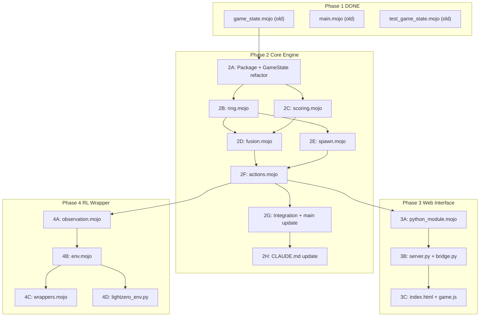

# Nucleo High-Fidelity Implementation Plan

This plan is self-contained. An implementing agent needs only this file and the repository's source code. Every section carries all necessary context.

---

## 1. Repository Context (What Already Exists)

Phase 1 is DONE. The following files exist:

- [pixi.toml](pixi.toml) -- project manifest, `mojo >=0.26.2,<0.27`, tasks for build/run/test/format, channels: `conda.modular.com/max` + `conda-forge`
- [.gitignore](.gitignore) -- standard Mojo/pixi ignores
- [src/game_state.mojo](src/game_state.mojo) -- `GameState` struct with `InlineArray[Int8, 18]` ring, `reset()`, `spawn_piece()`, `write_to()`. **This will be rewritten.**
- [src/main.mojo](src/main.mojo) -- CLI entrypoint. **Will be updated.**
- [tests/test_game_state.mojo](tests/test_game_state.mojo) -- 5 passing tests. **Will be rewritten.**

**CRITICAL**: The current `GameState` uses a fixed 18-slot `InlineArray` and treats Plus as ephemeral. This is wrong. The rewrite replaces it with a dynamic `List[Int8]` token ring where Plus and BlackPlus persist on the board.

---

## 2. Mojo 0.26.2 Syntax Rules

These override any pretrained knowledge. Every generated file MUST follow them.

| Removed | Replacement |
|---------|-------------|
| `fn` | `def` (does NOT imply `raises`; add `raises` explicitly) |
| `alias` | `comptime` |
| `let` | `var` |
| `inout self` in `__init__` | `out self` |
| `inout` | `mut` |
| `owned` | `var` (as argument convention) |
| `@value` | `@fieldwise_init` |
| `Stringable` / `__str__` | `Writable` / `write_to(self, mut writer: Some[Writer])` |
| `from collections import` | `from std.collections import` |
| `DynamicVector[T]` | `List[T]` |

- `comptime` for compile-time constants: `comptime MAX_ATOMS: Int = 18`
- `InlineArray[T, N]` for fixed-size arrays (T must be `Copyable`)
- `List[T]` for dynamic arrays (use bracket literals: `var x: List[Int8] = [1, 2, 3]`)
- `random_si64(min, max)` returns `Int64` in `[min, max]` inclusive
- `random_float64()` returns `Float64` in `[0.0, 1.0)`
- `seed(value)` for deterministic RNG; `seed()` for random
- Testing: `TestSuite.discover_tests[__functions_in_module()]().run()`
- All test tasks use `-I src` for module resolution
- No docstring literals inside struct bodies -- use comments above methods
- Explicit `.copy()` required for `List` and `Dict` (not `ImplicitlyCopyable`)
- Numeric conversions must be explicit: `Float64(my_int)`, `Int(my_float)`

---

## 3. Environment Bootstrap

The workspace does not expose `pixi` or `mojo` globally. All commands must use the repo-local environment:

```bash
export CONDA_PREFIX=.pixi/envs/default
export MODULAR_HOME=.pixi/envs/default/share/max
export PATH=.pixi/envs/default/bin:$PATH
```

Or use `pixi run <command>` which sets these automatically.

---

## 4. Game Mechanics Reference (Classic Mode -- Authoritative)

Sources: [Atomas Wiki](https://atomas.fandom.com/wiki/Atomas_Wiki), [Additive Atoms](https://atomas.fandom.com/wiki/Additive_Atoms), [Plus Atom](https://atomas.fandom.com/wiki/Plus_Atom), [Black Plus](https://atomas.fandom.com/wiki/Black_Plus), [Reaction](https://atomas.fandom.com/wiki/Reaction), [Modes](https://atomas.fandom.com/wiki/Modes).

### 4.1 Board Model

- The board is a **circular ring** of tokens
- Tokens are either **regular atoms** (positive Int8) or **additive specials** (negative Int8)
- The ring stores both atoms AND persistent specials (Plus, BlackPlus that haven't resolved)
- **`atom_count <= 18`** is the invariant (atoms = positive values only). Total token count can exceed 18.
- Game starts with **6 random atoms** (values 1-3)

### 4.2 Token Encoding

| Token | Int8 Value | Persists on Ring? |
|-------|-----------|-------------------|
| Empty | 0 | N/A |
| Regular atom (Hydrogen...) | 1, 2, 3, ... | Yes |
| Plus (Red Plus) | -1 | Yes (if neighbors don't match) |
| Minus (Electron) | -2 | No (consumed immediately on use) |
| Black Plus (Dark Plus) | -3 | Yes (if fewer than 2 neighbors) |
| Neutrino | -4 | No (consumed immediately on use) |

When Dark Plus fuses a Plus or BlackPlus token, treat the special's **effective fusion value as 1**. This matches wiki: Dark Plus + two Plus atoms = Beryllium(4) = max(1,1)+3.

### 4.3 Spawn Algorithm

**Roll order** (each turn, one roll determines the piece):

1. **Plus guarantee**: if `moves_since_plus >= 5`, force Plus. Reset counter.
2. **Plus chance**: `random_float64() < 0.17` (~17%). Reset counter on spawn.
3. **Minus chance**: `random_float64() < 0.05` (~5%, roughly every 20 moves).
4. **Black Plus**: `random_float64() < 0.0125` (1/80) ONLY when `score > 750`.
5. **Neutrino**: `random_float64() < 0.0167` (1/60) ONLY when `score > 1500`.
6. **Pity spawn**: if any atom on the ring is below the current spawn range AND `random_float64() < 1.0 / atom_count`, spawn a copy of that straggler value.
7. **Regular atom**: uniform random in `[max(1, M-4), max(1, M-1)]` where M = `highest_atom`.
8. **Edge case**: when `highest_atom <= 1`, always spawn Hydrogen(1).

**Initial board** (`spawn_initial_board`): place 6 atoms with values `random_si64(1, 3)`.

### 4.4 Plus Fusion (Persistent, Board-Driven)

When a Plus is placed between two **matching** regular atoms, it fuses them immediately. The result atom = `left_value + 1`. A chain reaction may follow (see 4.9).

When a Plus is placed between two **non-matching** atoms (or next to specials), the Plus **persists on the ring as a token**. It does NOT get consumed or wasted.

Later, when ANY token placement changes the Plus's neighbors to matching atoms, the Plus triggers a reaction. This is resolved by the **board-driven scan** (see 4.8).

**Counter-clockwise precedence**: when an atom is placed between two Plus tokens that could both react, the Plus that is counter-clockwise (decreasing index direction, wrapping) from the placement point reacts first.

### 4.5 Black Plus Fusion

- Fuses **any** two adjacent atoms (no match required)
- Result = `max(effective_value(left), effective_value(right)) + 3`
- After initial fusion, normal chain reaction rules apply (matching neighbors only)
- If BlackPlus has **fewer than 2 atom neighbors** (e.g., only 1 atom on ring), it **persists on the ring** until the next placement gives it 2 neighbors
- Score contribution: `floor((effective_value(left) + effective_value(right)) / 2)`

### 4.6 Minus Behavior (Two-Phase Turn)

**Phase 1** (piece in hand = MINUS): player selects a regular atom on the ring.
- That atom is **removed** from the ring
- `holding_piece = True`, `held_piece = removed_value`, `held_can_convert = True`

**Phase 2**: player either:
- Places the held atom at any gap (normal insertion, may trigger board scan)
- Converts the held atom to a Plus (special action CONVERT_ACTION)

### 4.7 Neutrino Behavior (Two-Phase Turn)

**Phase 1** (piece in hand = NEUTRINO): player selects a regular atom on the ring.
- That atom's value is **copied** (the original stays on the ring)
- `holding_piece = True`, `held_piece = copied_value`, `held_can_convert = False`

**Phase 2**: player places the copied atom at any gap (normal insertion, may trigger board scan). **Cannot** convert to Plus.

**Key difference from Minus**: does not remove the original atom. Placing the copy **adds** to atom_count. If `atom_count` was already 18, placing the copy ends the game unless a chain reaction reduces it.

### 4.8 Board-Driven Reaction Scan (Core Algorithm)

This is the **central game mechanic**. After ANY token is placed on the ring (from hand, from held piece, initial Plus/BlackPlus placement), execute:

```
def resolve_board(mut state, placement_idx) -> total_score:
    total_score = 0
    changed = True
    scan_origin = placement_idx

    while changed:
        changed = False
        best_idx = -1
        best_ccw_dist = len(state.pieces) + 1

        # Scan all tokens for reactable Plus/BlackPlus
        for i in range(len(state.pieces)):
            token = state.pieces[i]

            if token == PLUS:
                left = left_neighbor(state, i)
                right = right_neighbor(state, i)
                lv = state.pieces[left]
                rv = state.pieces[right]
                if lv > 0 and rv > 0 and lv == rv:
                    ccw = ccw_distance(scan_origin, i, len(state.pieces))
                    if ccw < best_ccw_dist:
                        best_ccw_dist = ccw
                        best_idx = i

            elif token == BLACK_PLUS:
                left = left_neighbor(state, i)
                right = right_neighbor(state, i)
                if left != i and right != i:
                    lv = effective_value(state.pieces[left])
                    rv = effective_value(state.pieces[right])
                    if lv > 0 and rv > 0:
                        ccw = ccw_distance(scan_origin, i, len(state.pieces))
                        if ccw < best_ccw_dist:
                            best_ccw_dist = ccw
                            best_idx = i

        if best_idx >= 0:
            if state.pieces[best_idx] == PLUS:
                score, merged_idx = resolve_plus(state, best_idx)
            else:
                score, merged_idx = resolve_black_plus(state, best_idx)
            total_score += score
            scan_origin = merged_idx
            changed = True

    return total_score
```

Where `ccw_distance(from, to, size) = (from - to + size) % size` (0 means same position; lower = closer counter-clockwise).

### 4.9 Chain Reaction Math

After a Plus resolves (simple merge), check the merged atom's neighbors for further chains:

```
def chain_react(mut state, center_idx, depth) -> score:
    if len(state.pieces) < 3: return 0
    left = left_neighbor(state, center_idx)
    right = right_neighbor(state, center_idx)
    if left == center_idx or right == center_idx: return 0
    if left == right: return 0

    lv = effective_value(state.pieces[left])
    rv = effective_value(state.pieces[right])
    if lv <= 0 or rv <= 0: return 0   # non-atom neighbor stops chain
    if lv != rv: return 0              # no match

    C = state.pieces[center_idx]       # center value
    Y = lv                             # outer matching value
    M = 1.0 + 0.5 * Float64(depth)

    if Y < C:
        new_center = C + 1
        score = floor(M * Float64(C + 1))
    else:
        new_center = Y + 2
        score = floor(M * Float64(C + 1)) + floor(2.0 * M * Float64(Y - C + 1))

    # Remove left and right atoms, update center
    remove_token(state, max(left, right))
    remove_token(state, min(left, right))
    adjusted_idx = find_index_of_center(state)
    state.pieces[adjusted_idx] = new_center
    update_highest(state)

    return score + chain_react(state, adjusted_idx, depth + 1)
```

**Canonical test**: `[9, 3, 3, 3, +, 3, 3, 3, 9]` with Plus at index 4:
- 3==3 match: merge to 4. Ring: `[9, 3, 3, 4, 3, 3, 9]`
- 3==3 match (3 < 4): 4+1=5. Ring: `[9, 3, 5, 3, 9]`
- 3==3 match (3 < 5): 5+1=6. Ring: `[9, 6, 9]`
- 9==9 match (9 >= 6): 9+2=11. Ring: `[11]`

### 4.10 Scoring Formulas

| Event | Formula |
|-------|---------|
| Simple reaction (depth 1) | `floor(1.5 * (Z + 1))` where Z = original atom value |
| Chain depth r >= 2, outer < center | `floor(M * (C + 1))`, M = 1 + 0.5*r |
| Chain depth r >= 2, outer >= center | `floor(M * (C + 1)) + floor(2*M * (Y - C + 1))` |
| Black Plus initial fusion | `floor((left + right) / 2)` |
| End of game bonus | Sum of all atom values on ring |

**For RL reward**: use linear element value of merged atom, not raw score.

### 4.11 Terminal Condition

The game ends when:
- `atom_count == 18` AND the next spawned piece is a regular atom (would push past 18)

The game does NOT end when:
- `atom_count == 18` but the piece is Plus/BlackPlus/Minus/Neutrino (all can reduce or don't add atoms, except Neutrino which adds -- Neutrino at 18 atoms is playable but will end the game after placement unless chain reaction fires)

### 4.12 Action Space

The action space is **dynamic** based on game state:

| State | Legal Actions |
|-------|--------------|
| Regular atom in hand | 0..`len(pieces)` - 1 (insert at gap i). If ring empty: only action 0. |
| Plus in hand | 0..`len(pieces)` - 1 (insert at gap i) |
| BlackPlus in hand | 0..`len(pieces)` - 1 (insert at gap i) |
| Minus phase 1 | i where `pieces[i] > 0` (select regular atom to absorb) |
| Neutrino phase 1 | i where `pieces[i] > 0` (select regular atom to copy) |
| Holding piece phase 2 | 0..`len(pieces)` (insert at gap) + CONVERT action if `held_can_convert` |

"Gap i" means: insert between `pieces[(i-1) % N]` and `pieces[i]` in the circular ring. With N tokens there are N gaps.

For the RL wrapper: project to `MAX_ACTIONS = 65` (indices 0-63 for positions, index 64 for convert) with a boolean mask.

---

## 5. Architecture

### 5.1 Package Structure

Reorganize into a Mojo package under `src/nucleo/` so Python bindings can import sibling modules:

```
src/
  nucleo/
    __init__.mojo          # package init, re-exports key types
    game_state.mojo        # GameState struct (the data model)
    ring.mojo              # circular ring operations
    fusion.mojo            # board-driven scan + chain reactions
    scoring.mojo           # score formulas
    spawn.mojo             # spawn RNG, initial board, pity
    actions.mojo           # legal_actions, apply_action, step
    python_module.mojo     # PythonModuleBuilder bindings
  main.mojo                # CLI entrypoint (thin, imports nucleo)
```

Update [pixi.toml](pixi.toml) tasks to use `-I src` so `from nucleo.game_state import GameState` resolves.

### 5.2 GameState Data Model

```
struct GameState(Writable):
    var pieces: List[Int8]          # ring tokens (atoms + persistent specials)
    var atom_count: Int             # count of positive values in pieces (cap: 18)
    var current_piece: Int8         # piece in the player's hand
    var score: Int
    var move_count: Int
    var highest_atom: Int8          # max positive value in pieces
    var holding_piece: Bool         # true during phase 2 of Minus/Neutrino
    var held_piece: Int8            # value of absorbed/copied atom
    var held_can_convert: Bool      # true if from Minus, false if from Neutrino
    var is_terminal: Bool
    var moves_since_plus: Int       # for Plus guarantee (max 5)
    var moves_since_minus: Int      # for Minus tracking
```

### 5.3 File Tree (After All Phases)

```
nucleo/
  CLAUDE.md                          # updated
  pixi.toml                         # updated with Python deps
  .gitignore
  src/
    nucleo/
      __init__.mojo
      game_state.mojo
      ring.mojo
      fusion.mojo
      scoring.mojo
      spawn.mojo
      actions.mojo
      python_module.mojo
    main.mojo
  tests/
    test_game_state.mojo
    test_ring.mojo
    test_fusion.mojo
    test_scoring.mojo
    test_spawn.mojo
    test_actions.mojo
    test_integration.mojo
  web/
    server.py
    bridge.py
    static/
      index.html
      game.js
  rl/
    observation.mojo
    env.mojo
    wrappers.mojo
    lightzero_env.py
```

---

## 6. Implementation Phases

### Phase 2A: Package Setup + GameState Refactor

**Deliverables**: `src/nucleo/__init__.mojo`, rewritten `src/nucleo/game_state.mojo`, rewritten `tests/test_game_state.mojo`, updated `src/main.mojo` imports, updated `pixi.toml`.

1. Create `src/nucleo/` directory and `__init__.mojo`
2. Rewrite `game_state.mojo` with the new struct (Section 5.2). The `__init__` takes an optional `game_seed: Int = -1` for deterministic seeding. `reset()` clears all fields, calls `seed(game_seed)` or `seed()`, but does NOT spawn the initial board (spawn module not yet built -- just zero everything).
3. Rewrite `tests/test_game_state.mojo` to test the new fields
4. Update `main.mojo` to `from nucleo.game_state import GameState`
5. Update `pixi.toml`: change build/run/test tasks for new paths. Add `python = "3.11.*"` dependency (needed later but pin now). Keep `mojo >=0.26.2,<0.27`.
6. Verify: `pixi run format && pixi run test`

### Phase 2B: Ring Operations

**File**: `src/nucleo/ring.mojo` + `tests/test_ring.mojo`

Functions (all take `mut state: GameState` or `state: GameState`):

- `insert_at(mut state, position: Int, token: Int8)` -- insert token at gap position, update `atom_count` and `highest_atom` if token > 0
- `remove_at(mut state, position: Int) -> Int8` -- remove and return token, shift list, update `atom_count` and `highest_atom`
- `left_neighbor(state, index: Int) -> Int` -- `(index - 1 + len(state.pieces)) % len(state.pieces)`
- `right_neighbor(state, index: Int) -> Int` -- `(index + 1) % len(state.pieces)`
- `recalculate_highest(mut state)` -- scan pieces, update `highest_atom`
- `recalculate_atom_count(mut state)` -- count positive values
- `effective_value(token: Int8) -> Int8` -- returns token if > 0, returns 1 if PLUS or BLACK_PLUS, returns 0 otherwise
- `ccw_distance(from_idx: Int, to_idx: Int, ring_size: Int) -> Int` -- `(from_idx - to_idx + ring_size) % ring_size`

**Tests**: insert at beginning/middle/end, remove from beginning/middle/end, circular neighbor wrapping, atom_count tracking, effective_value for all token types.

### Phase 2C: Scoring

**File**: `src/nucleo/scoring.mojo` + `tests/test_scoring.mojo`

- `simple_reaction_score(atom_value: Int) -> Int` -- `floor(1.5 * Float64(atom_value + 1))`
- `chain_reaction_score(center: Int8, outer: Int8, depth: Int) -> Int` -- full formula from Section 4.10
- `black_plus_score(left: Int8, right: Int8) -> Int` -- `Int((Int(left) + Int(right)) / 2)`
- `end_game_bonus(state: GameState) -> Int` -- sum of all positive values in pieces

**Tests**: Verify `simple_reaction_score(9) == 15` (Fluorine example from wiki), chain scores at depth 2 and 3 matching wiki examples (22, 30), black_plus_score, end_game_bonus.

### Phase 2D: Fusion Logic (Board-Driven Scan)

**File**: `src/nucleo/fusion.mojo` + `tests/test_fusion.mojo`

This is the most complex module. Implements three layers:

1. `resolve_board(mut state, placement_idx: Int) -> Int` -- the outer scan loop from Section 4.8
2. `resolve_plus(mut state, plus_idx: Int) -> Tuple[Int, Int]` -- resolve a single Plus: simple merge, then chain. Returns (score, merged_atom_index).
3. `resolve_black_plus(mut state, bp_idx: Int) -> Tuple[Int, Int]` -- resolve a single BlackPlus: fuse any two neighbors, then chain. Returns (score, merged_atom_index).
4. `chain_react(mut state, center_idx: Int, depth: Int) -> Int` -- recursive chain resolution from Section 4.9.

**Critical test cases**:
- `[3, +, 3]` -> `[4]`, score = 6
- `[9, 3, 3, 3, +, 3, 3, 3, 9]` -> `[11]` (canonical chain)
- Circular wrapping: Plus at index 0 with matching atoms at positions `[len-1]` and `[1]`
- `[5, BP, 16]` -> `[19]` (BlackPlus, max(5,16)+3=19)
- `[+, BP, +]` -> `[4]` (Dark Plus fusing two Plus atoms = Beryllium)
- Non-matching Plus persists: `[3, +, 5]` stays as `[3, +, 5]` (no reaction)
- Board-driven trigger: start with `[3, +, 5]`, then a later placement changes the 5 to a 3, triggering the Plus
- BlackPlus with 1 neighbor persists: `[He2, BP]` stays until next atom placed
- Chain that wraps entire ring and collapses to 1 element

### Phase 2E: Spawn System

**File**: `src/nucleo/spawn.mojo` + `tests/test_spawn.mojo`

- `spawn_piece(mut state)` -- full algorithm from Section 4.3
- `spawn_initial_board(mut state)` -- place 6 random atoms (values 1-3), set `atom_count = 6`, update `highest_atom`

**Tests**: Plus spawns at least every 5 moves over 1000 trials, BlackPlus never when score < 750, Neutrino never when score < 1500, initial board has 6 atoms in range [1,3], pity spawn can produce straggler values, `highest_atom <= 1` always gives Hydrogen.

### Phase 2F: Actions + Step

**File**: `src/nucleo/actions.mojo` + `tests/test_actions.mojo`

- `legal_actions(state: GameState) -> List[Bool]` -- returns mask sized to current action space (see Section 4.12). For RL, a separate wrapper pads to MAX_ACTIONS.
- `apply_action(mut state, action: Int) -> Int` -- dispatches on piece type:
  - Regular atom: `insert_at`, then `resolve_board`, then `spawn_piece`
  - Plus: `insert_at` (Plus goes on ring), then `resolve_board`, then `spawn_piece`
  - BlackPlus: `insert_at`, then `resolve_board`, then `spawn_piece`
  - Minus phase 1: `remove_at`, set holding state, do NOT spawn next piece yet
  - Neutrino phase 1: copy value, set holding state, do NOT spawn next piece yet
  - Held piece phase 2: `insert_at`, then `resolve_board`, clear holding state, then `spawn_piece`
  - Convert action: set `current_piece = PLUS`, clear holding, then player places the Plus on their next sub-turn (re-enter action for Plus)
  - Returns reward (linear value of highest atom created in merges, 0 if none)
- `step(mut state, action: Int) -> Tuple[Int, Bool]` -- calls `apply_action`, checks terminal, returns (reward, is_terminal)

**Tests**: legal actions for empty board, for 5 elements, at 18 atoms with Plus/Minus/Regular; apply regular insert, apply Plus with match, apply Plus without match (persists), apply Minus absorb + place, apply Neutrino copy + place, apply convert, terminal detection, full random game to completion.

### Phase 2G: Integration + Main Update

1. Update `src/nucleo/game_state.mojo` `reset()` to call `spawn_initial_board` (now available)
2. Update `src/main.mojo` to play a full random game: loop `step()` with random legal actions, print each move and final score
3. Create `tests/test_integration.mojo` -- play 100 seeded random games, verify: no crashes, all games terminate, scores are non-negative, `atom_count` never exceeds 18, `highest_atom` is consistent with ring contents
4. Update `pixi.toml` with test tasks for all test files (or a `test-all` task)
5. Run `pixi run format` on everything
6. Verify all tests pass

### Phase 2H: Update CLAUDE.md

Update the following sections in [CLAUDE.md](CLAUDE.md) to match the new architecture:
- Ring model: "dynamic `List[Int8]` token ring" not "fixed-size array of 18"
- Function style: "`def` not `fn`" (fn is deprecated)
- Token encoding: add Neutrino (-4)
- Action space: dynamic, MAX_ACTIONS=65 in RL wrapper
- MDP Observation: MAX_OBSERVATION_TOKENS=64 in RL wrapper
- Architecture file tree: update to package structure under `src/nucleo/`
- Add board-driven reaction description
- Add Neutrino to Elements section

### Phase 3A: Python Module

**File**: `src/nucleo/python_module.mojo`

Use `PythonModuleBuilder` (beta) to expose GameState to Python:

```
@export
fn PyInit_nucleo_engine() -> PythonObject:
    var m = PythonModuleBuilder("nucleo_engine")
    # Register functions: reset, step, legal_actions, get_state, get_pieces, ...
    return m.finalize()
```

Each exported function takes/returns `PythonObject`. The bridge converts between Mojo types and Python lists/dicts.

### Phase 3B: Web Server

**Files**: `web/server.py`, `web/bridge.py`

- `bridge.py`: `import mojo.importer; import nucleo_engine` -- wraps the Mojo module in a `NucleoGame` class with `reset()`, `step(action)`, `legal_actions()`, `get_state()`.
- `server.py`: FastAPI server with `POST /api/reset`, `POST /api/step`, `GET /api/state`, `GET /api/legal-actions`. Static file serving for frontend.
- Update `pixi.toml`: add `fastapi`, `uvicorn` dependencies from conda-forge. Add `serve` task.

### Phase 3C: Frontend

**Files**: `web/static/index.html`, `web/static/game.js`

- Vanilla JS + HTML Canvas
- Circular ring rendering with element symbols and colors
- Center piece display (current hand)
- Click handling: click gaps to insert, click atoms for Minus/Neutrino select
- Score, move counter, game over screen

### Phase 4A: Observation Encoding

**File**: `rl/observation.mojo`

- `get_observation(state) -> InlineArray[Int8, 64]` -- pad pieces to 64 slots, append current_piece, holding_piece flag, held_piece, held_can_convert
- `get_canonical_observation(state) -> InlineArray[Int8, 64]` -- rotate so highest atom at index 0 (reduces state space ~18x)

### Phase 4B: Gymnasium Environment

**File**: `rl/env.mojo`

- `NucleoEnv` struct with `reset(seed)`, `step(action)`, `legal_actions()`, `observation_space()`, `action_space()`
- Action masking: pad legal_actions to `InlineArray[Bool, 65]`
- If token count exceeds 64, raise clear error (don't alter game rules)

### Phase 4C: Reward Shaping

**File**: `rl/wrappers.mojo`

- Linear reward (element value of merged atom)
- Shaped reward (small positive for reducing atom_count, small negative for increasing)
- Terminal penalty (negative proportional to remaining atoms)
- Normalized reward (scale to [-1, 1])

### Phase 4D: LightZero Adapter

**File**: `rl/lightzero_env.py`

- Python wrapper using `mojo.importer` to load the Mojo env
- Returns `{'observation': array, 'action_mask': array, 'to_play': -1}` dict format
- Import-guarded: `try: from lzero.envs import BaseEnv` so the project doesn't break without LightZero

---

## 7. Dependency Graph



---

## 8. Test Plan Summary

Every module gets its own test file. Tests are written BEFORE or alongside implementation. Key invariants asserted in every test:
- `atom_count` matches actual count of positive values in `pieces`
- `highest_atom` matches actual max positive value
- No index-out-of-bounds on circular operations
- Score is non-negative and monotonically non-decreasing within a game

**Soak test** (Phase 2G): 100 seeded random games played to completion. Assert all terminate, no crashes, invariants hold.

**Web smoke test** (Phase 3B): one FastAPI round-trip: reset -> step -> state -> legal-actions.

**RL smoke test** (Phase 4D): conditional on LightZero being installed.
