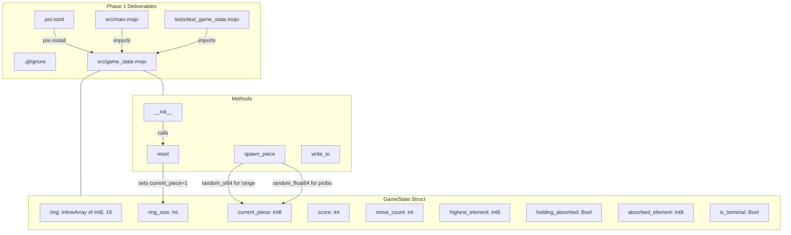

# Phase 1: Project Scaffolding and Core Data Structures

## Current State

The repo is empty -- just `CLAUDE.md`, `README.md`, `agents.md`, and `.cursor/` config. No `pixi.toml`, no `src/`, no `.mojo` files, no `.gitignore`.

**Tooling available:** pixi 0.66.0 is installed. Stable Mojo channel (`https://conda.modular.com/max/`) has `max` 26.2.0 with `mojo` 0.26.2.

## Critical Mojo Syntax Notes (from mojo-syntax skill)

These override any pretrained knowledge and are essential for every file:

- **`def` not `fn`** -- `fn` is deprecated. `def` does NOT imply `raises`; add `raises` explicitly when needed.
- **`comptime` not `alias`** -- for compile-time constants, type aliases, static if/for.
- **`out self`** in `__init__`, **`mut self`** for mutating methods, **`var`** for owned args.
- **`var` not `let`** -- no `let` keyword exists.
- **`@fieldwise_init`** replaces `@value`.
- **`Writable` / `write_to`** replaces `Stringable` / `__str__`.
- **Imports use `std.` prefix**: `from std.testing import ...`, `from std.random import ...`.
- **`InlineArray[T, N]`** for fixed-size arrays (T must be `Copyable`).
- **`random_si64(min, max)`** returns a random `Int64` in [min, max] inclusive -- ideal for spawn range.
- **Testing:** `TestSuite.discover_tests[__functions_in_module()]().run()` for test discovery.

## Deliverables (6 files)

### 1. `pixi.toml` -- Project configuration

```toml
[workspace]
name = "nucleo"
channels = ["https://conda.modular.com/max", "conda-forge"]
platforms = ["osx-arm64"]
version = "0.1.0"

[dependencies]
max = ">=26.2"

[tasks]
build = "mojo build src/main.mojo -o nucleo"
run = "mojo run src/main.mojo"
test = "mojo run tests/test_game_state.mojo"
format = "mojo format src/ tests/"
```

After creating this, run `pixi install` to fetch Mojo, then `pixi run mojo --version` to verify.

### 2. `.gitignore`

Standard ignores for Mojo/pixi: `.pixi/`, `*.mojopkg`, `__pycache__/`, `.env`, build artifacts, the `nucleo` binary.

### 3. `src/game_state.mojo` -- Core struct

The `GameState` struct contains:

```
comptime MAX_RING_SIZE = 18

comptime PLUS: Int8 = -1
comptime MINUS: Int8 = -2  
comptime BLACK_PLUS: Int8 = -3
comptime EMPTY: Int8 = 0

comptime PLUS_SPAWN_CHANCE = 0.17  # ~17%, roughly every 5-6 moves
comptime MINUS_SPAWN_CHANCE = 0.05  # ~5%, roughly every 20 moves

struct GameState(Writable):
    var ring: InlineArray[Int8, 18]
    var ring_size: Int
    var current_piece: Int8
    var score: Int
    var move_count: Int
    var highest_element: Int8
    var holding_absorbed: Bool
    var absorbed_element: Int8
    var is_terminal: Bool
```

Key methods:

- **`__init__(out self)`** -- constructs with zeroed state, then calls `reset()`
- **`reset(mut self)`** -- clears ring to all zeros via `InlineArray[Int8, 18](fill=0)`, resets all fields, spawns Hydrogen (1) as `current_piece`
- **`spawn_piece(mut self)`** -- uses `random_si64` and `random_float64` to:
  - Roll for Plus/Minus/BlackPlus using hardcoded probabilities
  - Otherwise spawn regular element in range `[max(1, M-4), max(1, M-1)]` where M = `highest_element`
  - Edge case: when `highest_element <= 1`, always spawns Hydrogen (1)
- **`write_to(self, mut writer: Some[Writer])`** -- prints ring contents, current piece, score, etc. for debugging

Random seeding: call `seed()` once in `__init__` or at module scope. Use `random_si64` for integer range, `random_float64(0.0, 1.0)` for probability rolls.

### 4. `src/main.mojo` -- Entrypoint

```mojo
from game_state import GameState

def main() raises:
    var game = GameState()
    print("=== Nucleo Game Engine ===")
    print("Initial state after reset:")
    print(game)
    print("Ring size:", game.ring_size)
    print("Current piece:", game.current_piece)
    print("Score:", game.score)
    print("Highest element:", game.highest_element)
    print("Terminal:", game.is_terminal)
```

This verifies the struct compiles, constructs, resets, and prints.

### 5. `tests/test_game_state.mojo` -- Initial tests

Tests using `TestSuite.discover_tests`:

- **`test_reset_produces_valid_state`** -- after reset, `ring_size == 0`, `score == 0`, `move_count == 0`, `is_terminal == False`, `holding_absorbed == False`
- **`test_ring_empty_after_reset`** -- all 18 slots are 0
- **`test_current_piece_valid_after_reset`** -- `current_piece > 0` (is a valid element)
- **`test_spawn_piece_range`** -- set `highest_element` to various values, call `spawn_piece` many times, verify results are always in expected range
- **`test_constants`** -- verify `PLUS == -1`, `MINUS == -2`, `BLACK_PLUS == -3`

### 6. Verification steps

After all files are written:

1. `pixi run format` -- format all `.mojo` files
2. `pixi run build` -- verify compilation
3. `pixi run run` -- verify main prints expected output
4. `pixi run test` -- verify all tests pass

## Architecture diagram



## File dependency order

Build these sequentially:

1. `pixi.toml` + `.gitignore` (then run `pixi install`)
2. `src/game_state.mojo` (core struct -- must compile standalone)
3. `src/main.mojo` (imports game_state, verify with `pixi run run`)
4. `tests/test_game_state.mojo` (verify with `pixi run test`)
5. Run `pixi run format` on everything
