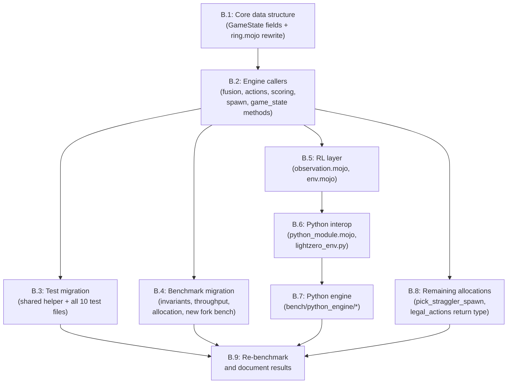

# Phase B: Stack Allocation, Value Semantics, and Zero-Allocation Hot Path

---

## 0. What This Phase Achieves

Replace the heap-allocated `List[Int8]` ring with stack-allocated `InlineArray[Int8, 36]` + `token_count: Int`. Eliminate every heap allocation from the `step()` hot path. Shrink the RL observation/action tensors to match the tighter engine capacity. Re-benchmark to measure the expected 3-10x speedup over the Phase A baseline (~800K steps/sec).

---

## 1. Critical InlineArray Rules (Read Before Writing Any Code)

`InlineArray[Int8, 36]` behaves fundamentally differently from `List[Int8]`. The implementing agent MUST internalize these rules:

| Trap | What Happens | Correct Pattern |
| --- | --- | --- |
| `len(state.pieces)` | Returns **36** (compile-time capacity), NOT logical count | Use `state.token_count` everywhere |
| `for token in state.pieces:` | Iterates **all 36 slots** including zero-padding | Use `for i in range(state.token_count): var token = state.pieces[i]` |
| `state.pieces = [Int8(3), Int8(3)]` | Only works if literal has exactly 36 elements | Use `set_pieces()` helper or element-by-element assignment |
| `state.pieces = []` | Does not compile for InlineArray | Use `state.token_count = 0` (slots become logically unused) |
| `state.pieces.append(x)` | InlineArray has no `append` | Use `state.pieces[state.token_count] = x; state.token_count += 1` |
| `state.pieces = new_pieces^` | InlineArray is `ImplicitlyCopyable`; no move-transfer needed | Just assign: `state.pieces = new_pieces` |
| Pass `state.pieces` as `List[Int8]` param | Type mismatch | Change param type or pass `(state.pieces, state.token_count)` |

**Initialization**: `InlineArray[Int8, 36](fill=0)` zero-fills all 36 slots.

**Verification after every file change**:
```
pixi run format && pixi run test
```

---

## 2. New Constants

Add to [`src/nucleo/game_state.mojo`](src/nucleo/game_state.mojo):

```mojo
comptime MAX_RING_CAPACITY: Int = 36
```

Update [`rl/observation.mojo`](rl/observation.mojo):

```mojo
comptime TOKEN_SLOT_COUNT: Int = 36      # was 60
comptime OBSERVATION_SIZE: Int = 40      # was 64 (36 + 4 metadata)
```

Update [`rl/env.mojo`](rl/env.mojo):

```mojo
comptime MAX_ACTIONS: Int = 37           # was 65 (36 gaps + 1 convert)
```

Update [`rl/lightzero_env.py`](rl/lightzero_env.py):

```python
TOKEN_SLOT_COUNT = 36    # was 60
OBSERVATION_SIZE = 40    # was 64
MAX_ACTIONS = 37         # was 65
```

---

## 3. GameState Field Changes

[`src/nucleo/game_state.mojo`](src/nucleo/game_state.mojo) -- the `GameState` struct changes from:

```mojo
var pieces: List[Int8]
```

to:

```mojo
var pieces: InlineArray[Int8, MAX_RING_CAPACITY]
var token_count: Int
```

Every method on `GameState` that touches `pieces` must be updated. The total struct size becomes approximately: 36 bytes (pieces) + 14 fields * ~8 bytes = ~148 bytes. This still fits in two Apple Silicon L1 cache lines (128 bytes each).

---

## 4. ring.mojo Rewrite

[`src/nucleo/ring.mojo`](src/nucleo/ring.mojo) -- the two hot-path functions change from list-rebuild to in-place shift:

**`insert_at` (before)**: Creates new `List[Int8]`, copies all elements, assigns with move. 1 heap allocation.

**`insert_at` (after)**: Shift elements rightward in-place, write new token, increment `token_count`. Zero allocations.

```mojo
def insert_at(mut state: GameState, position: Int, token: Int8):
    debug_assert(
        state.token_count < MAX_RING_CAPACITY,
        "insert_at: ring overflow at capacity ", MAX_RING_CAPACITY,
    )
    # Shift elements right from the end to make room
    for i in range(state.token_count, position, -1):
        state.pieces[i] = state.pieces[i - 1]
    state.pieces[position] = token
    state.token_count += 1

    if token > 0:
        state.atom_count += 1
        if token > state.highest_atom:
            state.highest_atom = token
```

**`remove_at` (before)**: Creates new `List[Int8]`, copies all except removed. 1 heap allocation.

**`remove_at` (after)**: Save token, shift elements leftward, decrement `token_count`. Zero allocations.

```mojo
def remove_at(mut state: GameState, position: Int) -> Int8:
    var removed = state.pieces[position]
    # Shift elements left to fill the gap
    for i in range(position, state.token_count - 1):
        state.pieces[i] = state.pieces[i + 1]
    state.token_count -= 1

    if removed > 0:
        state.atom_count -= 1
        recalculate_highest(state)

    return removed
```

**Other ring.mojo functions** -- mechanical `len(state.pieces)` to `state.token_count` changes:

- `left_neighbor`: line 46/49 -- `len(state.pieces)` to `state.token_count`
- `right_neighbor`: line 53/56 -- same
- `recalculate_highest`: line 61 -- `len(state.pieces)` to `state.token_count`; loop becomes `for i in range(state.token_count):`
- `recalculate_atom_count`: line 75 -- same pattern
- `ccw_distance`: no change (takes `ring_size: Int` parameter)

---

## 5. Mechanical Migration Pattern (All Other Engine Files)

Every file in `src/nucleo/` outside ring.mojo needs the same set of mechanical transforms. There are approximately **30 sites** of `len(state.pieces)` and **8 sites** of `for token in state.pieces:` across fusion, actions, scoring, and game_state methods.

### 5.1 fusion.mojo (~15 changes)

All `len(state.pieces)` calls in `plus_can_react`, `black_plus_can_react`, `chain_react`, `resolve_plus`, `resolve_black_plus`, `resolve_board_outcome` become `state.token_count`. The `state.pieces[i]` index reads are unchanged (InlineArray supports `[]`). The `state.pieces[adjusted_center] = new_center` write is unchanged.

### 5.2 actions.mojo (~8 changes)

- `gap_action_count`: `len(state.pieces)` to `state.token_count`
- `legal_actions`: changes from returning `List[Bool]` to `InlineArray[Bool, MAX_ACTIONS]` (see section 7)
- `finish_placement_turn`: no `len` changes (calls `insert_at` which is already updated)
- `apply_action`: `state.pieces[action]` reads unchanged
- The `for token in state.pieces:` in legal_actions (line 55, for Minus/Neutrino mask) becomes `for i in range(state.token_count): var token = state.pieces[i]`

### 5.3 scoring.mojo (1 change)

`end_game_bonus`: `for token in state.pieces:` becomes `for i in range(state.token_count): var token = state.pieces[i]`

### 5.4 game_state.mojo methods (~10 changes)

- `__init__`: `self.pieces = []` becomes `self.pieces = InlineArray[Int8, MAX_RING_CAPACITY](fill=0); self.token_count = 0`
- `reset`: same change
- `spawn_initial_board`: `self.pieces = []; ... self.pieces.append(x)` becomes `self.token_count = 0; ... self.pieces[self.token_count] = x; self.token_count += 1`
- `pick_straggler_spawn`: `for token in self.pieces:` becomes index loop
- `write_to`: must manually format pieces since `InlineArray` Writable would print all 36 slots

---

## 6. Shared Test Helper: `set_pieces`

Many test files (test_fusion, test_actions, test_ring, test_scoring, test_spawn, test_rl_modules) set up board state via `game.pieces = [Int8(3), Int8(3)]`. With `InlineArray[Int8, 36]` this pattern no longer works because the literal must have exactly 36 elements.

Create a shared helper module at [`tests/helpers.mojo`](tests/helpers.mojo) (or inline in each test file):

```mojo
from nucleo.game_state import GameState, MAX_RING_CAPACITY
from nucleo.ring import recalculate_atom_count, recalculate_highest

def set_pieces(mut game: GameState, var tokens: List[Int8]):
    """Populate the InlineArray ring from a List literal, then recalculate derived fields."""
    game.token_count = len(tokens)
    for i in range(len(tokens)):
        game.pieces[i] = tokens[i]
    recalculate_atom_count(game)
    recalculate_highest(game)
```

Call sites change from:

```mojo
game.pieces = [Int8(3), PLUS, Int8(3)]
recalculate_atom_count(game)
recalculate_highest(game)
```

to:

```mojo
set_pieces(game, [Int8(3), PLUS, Int8(3)])
```

The `List[Int8]` parameter is fine because test setup is not on the hot path. The heap allocation happens once per test case, not per game step.

**Files requiring `set_pieces` updates**: `test_fusion.mojo` (12 call sites), `test_actions.mojo` (10), `test_ring.mojo` (7), `test_scoring.mojo` (1), `test_spawn.mojo` (1), `test_rl_modules.mojo` (1).

**Files with direct `game.pieces[i]` assertions**: These stay the same -- `InlineArray` supports `[]` indexing.

**Files with `len(game.pieces)` assertions**: All ~22 sites change to `game.token_count`.

---

## 7. legal_actions Return Type Change

[`src/nucleo/actions.mojo`](src/nucleo/actions.mojo) -- `legal_actions` currently returns `List[Bool]` (heap allocation per call). Change to:

```mojo
comptime MAX_ACTION_SLOTS: Int = 37   # MAX_RING_CAPACITY + 1 (convert)

def legal_actions(state: GameState) -> Tuple[InlineArray[Bool, MAX_ACTION_SLOTS], Int]:
```

Returns a tuple of (mask, valid_count) where:
- `mask[i]` is True if action `i` is legal
- `valid_count` is the number of meaningful positions in the mask

This cascades to every consumer of `legal_actions`:

| Consumer | File | Change |
| --- | --- | --- |
| `choose_random_legal_action` | `src/main.mojo`, `bench/bench_throughput.mojo`, `tests/test_integration.mojo`, `tests/test_stress.mojo` | Parameter `List[Bool]` becomes `(InlineArray[Bool, MAX_ACTION_SLOTS], Int)` or just iterate up to `valid_count` |
| `first_legal_action` | `tests/test_determinism.mojo` | Same |
| `count_true` | `tests/test_actions.mojo` | Same |
| `mask_to_python` | `src/nucleo/python_module.mojo` | Takes InlineArray + count |
| `legal_actions` wrapper | `rl/env.mojo` | Pads to `InlineArray[Bool, MAX_ACTIONS]` |

---

## 8. pick_straggler_spawn: Eliminate Temporary List

[`src/nucleo/game_state.mojo`](src/nucleo/game_state.mojo) lines 88-105 -- `pick_straggler_spawn` currently builds a `var stragglers: List[Int8] = []` then selects randomly. Replace with a two-pass scan:

```mojo
def pick_straggler_spawn(self, minimum_regular: Int) -> Int8:
    # Count stragglers without allocating
    var straggler_count = 0
    for i in range(self.token_count):
        var token = self.pieces[i]
        if token > 0 and Int(token) < minimum_regular:
            straggler_count += 1

    if straggler_count == 0 or self.atom_count <= 0:
        return EMPTY

    var pity_threshold = 1.0 / Float64(self.atom_count)
    if random_float64() >= pity_threshold:
        return EMPTY

    # Select the Nth straggler without a list
    var target = Int(random_si64(0, Int64(straggler_count - 1)))
    var seen = 0
    for i in range(self.token_count):
        var token = self.pieces[i]
        if token > 0 and Int(token) < minimum_regular:
            if seen == target:
                return token
            seen += 1

    return EMPTY
```

---

## 9. Python Interop Layer

### 9.1 python_module.mojo

[`src/nucleo/python_module.mojo`](src/nucleo/python_module.mojo) -- `pieces_to_python` currently takes `List[Int8]`. Change to iterate `state.token_count` elements from the InlineArray:

```mojo
def pieces_to_python(state: GameState) raises -> PythonObject:
    var py_pieces = Python.list()
    for i in range(state.token_count):
        py_pieces.append(Int(state.pieces[i]))
    return py_pieces
```

`mask_to_python` currently takes `List[Bool]`. Change to take the new action mask type:

```mojo
def mask_to_python(
    mask: InlineArray[Bool, MAX_ACTION_SLOTS], valid_count: Int
) raises -> PythonObject:
    var py_mask = Python.list()
    for i in range(valid_count):
        py_mask.append(mask[i])
    return py_mask
```

### 9.2 web/bridge.py

[`web/bridge.py`](web/bridge.py) -- `normalize_state` needs no structural changes if `pieces_to_python` already emits only active tokens (trimmed to `token_count`). The Python-side `pieces` remains a variable-length `list[int]`.

### 9.3 lightzero_env.py

[`rl/lightzero_env.py`](rl/lightzero_env.py) -- update the three constants (section 2). The `encode_observation` and `encode_action_mask` functions work on Python lists whose lengths are already bounded by the new constants. The Gymnasium `observation_space` and `action_space` must be rebuilt with the new sizes.

---

## 10. Python Benchmark Engine

[`bench/python_engine/`](bench/python_engine/) -- the Python port should mirror the Mojo change:

- `game_state.py`: Add `token_count: int` field. Keep `pieces` as `list[int]` (Python lists are fine for baseline comparison) but track `token_count` for API parity.
- `ring.py`: `insert_at`/`remove_at` change to shift-based logic matching the Mojo version. All `len(state.pieces)` become `state.token_count`.
- `fusion.py`, `actions.py`, `scoring.py`, `spawn.py`: All `len(state.pieces)` become `state.token_count`.
- `verify_cross_validation.py`: Both normalizer functions trim `pieces` to `token_count`.

---

## 11. Benchmark Updates

### 11.1 bench/invariants.mojo

- `expected_highest_atom` parameter changes from `List[Int8]` to accept `GameState` directly
- `assert_game_invariants`: all `len(state.pieces)` to `state.token_count`; `for token in state.pieces:` to index loop
- Add new assertion: `state.token_count <= MAX_RING_CAPACITY`
- Add new assertion: `state.token_count >= state.atom_count`

### 11.2 bench/bench_allocation.mojo

- `seed_state()`: Replace `game.pieces = [Int8(1),...,Int8(12)]` with element-by-element population + `game.token_count = 12`
- All `len(game.pieces)` to `game.token_count`
- The benchmark now measures **shift throughput** (not allocation throughput) -- the semantics change and the numbers will be dramatically higher

### 11.3 bench/bench_throughput.mojo

- `choose_random_legal_action`: adapt to new `legal_actions` return type
- No other changes needed (delegates to `step()` which is already updated)

### 11.4 New benchmark: bench/bench_fork.mojo

Add a fork-cost benchmark as specified by PRD B.5:

```mojo
def main() raises:
    var state = GameState(42)
    # Play a few moves to get a realistic state
    for _ in range(10):
        var mask_result = legal_actions(state)
        _ = step(state, 0)

    # Measure copy cost
    var start = perf_counter_ns()
    for _ in range(1_000_000):
        var copy = state  # InlineArray is ImplicitlyCopyable
        _ = copy.score    # prevent dead-code elimination
    var elapsed = perf_counter_ns() - start
    print("Fork cost (ns):", Float64(elapsed) / 1_000_000.0)
```

Target: < 10 nanoseconds per fork (PRD requirement).

---

## 12. Architecture After Phase B

```mermaid
flowchart LR
    subgraph gameState ["GameState (~148 bytes, stack-allocated)"]
        Pieces["pieces: InlineArray[Int8, 36]"]
        TokenCount["token_count: Int"]
        AtomCount["atom_count: Int"]
        Score["score: Int"]
        Rest["... 10 more scalar fields"]
    end

    subgraph ringOps ["ring.mojo (zero-allocation)"]
        InsertAt["insert_at: shift-right in-place"]
        RemoveAt["remove_at: shift-left in-place"]
        Recalc["recalculate_highest/atom_count: index loop"]
    end

    subgraph actionOps ["actions.mojo (zero-allocation)"]
        LegalActions["legal_actions: returns InlineArray[Bool, 37]"]
        ApplyAction["apply_action: calls ring ops"]
        Step["step: apply_action + spawn"]
    end

    subgraph rlLayer ["RL Layer (tighter tensors)"]
        Obs["observation: InlineArray[Int8, 40]"]
        Mask["action_mask: InlineArray[Bool, 37]"]
    end

    gameState --> ringOps
    ringOps --> actionOps
    actionOps --> rlLayer
```



### Zero-Allocation Hot Path

After Phase B, `step()` calls this chain with **zero** heap allocations:

```
step() -> apply_action() -> legal_actions()    [InlineArray return]
                          -> insert_at()        [in-place shift]
                          -> resolve_board()    [reads InlineArray]
                            -> remove_at()      [in-place shift]
                            -> chain_react()    [recursive, stack only]
                          -> spawn_piece()      [pick_straggler_spawn: scan, no temp list]
```

---

## 13. Dependency Graph and Implementation Order



**Recommended execution order**:
1. B.1 -- Core data structure change (nothing compiles after this until B.2)
2. B.2 -- Fix all engine callers (engine compiles again)
3. B.3 -- Fix all tests (tests pass again)
4. B.8 -- Eliminate remaining allocations (legal_actions, pick_straggler_spawn) while tests are green
5. B.4 -- Fix benchmarks
6. B.5 -- Fix RL layer
7. B.6 -- Fix Python interop
8. B.7 -- Fix Python benchmark engine
9. B.9 -- Run full benchmark suite, compare to Phase A, document

---

## 14. Complete File Impact Map

| File | Changes | Severity |
| --- | --- | --- |
| `src/nucleo/game_state.mojo` | Field type, `__init__`, `reset`, `spawn_initial_board`, `pick_straggler_spawn`, `write_to` | HEAVY |
| `src/nucleo/ring.mojo` | `insert_at`, `remove_at` rewrite; 6 `len()` changes; 2 iteration changes | HEAVY |
| `src/nucleo/fusion.mojo` | ~15 `len()` changes, 1 iteration change | HEAVY |
| `src/nucleo/actions.mojo` | `legal_actions` return type + body, `gap_action_count`, 1 iteration | HEAVY |
| `src/nucleo/scoring.mojo` | 1 iteration change in `end_game_bonus` | LOW |
| `src/nucleo/spawn.mojo` | No change (thin wrappers) | NONE |
| `src/nucleo/python_module.mojo` | `pieces_to_python` and `mask_to_python` signatures + bodies | MODERATE |
| `src/main.mojo` | `choose_random_legal_action` param type | LOW |
| `rl/observation.mojo` | Constants + 8 `len()` changes | MODERATE |
| `rl/env.mojo` | `MAX_ACTIONS` constant, return type cascade | MODERATE |
| `rl/wrappers.mojo` | No change | NONE |
| `rl/lightzero_env.py` | 3 constants, `encode_observation`, `encode_action_mask`, Gymnasium spaces | MODERATE |
| `tests/test_ring.mojo` | 7 `game.pieces = [...]`, 3 `len()`, 10 `pieces[i]` | HEAVY |
| `tests/test_fusion.mojo` | 12 `set_state_pieces` calls, 9 `len()`, 15 `pieces[i]` | HEAVY |
| `tests/test_actions.mojo` | `set_state_pieces` + `count_true`, 6 `len()`, 11 `pieces[i]` | HEAVY |
| `tests/test_game_state.mojo` | 3 `len()`, 2 `pieces[i]`, 1 iteration | MODERATE |
| `tests/test_scoring.mojo` | 1 `game.pieces = [...]` | LOW |
| `tests/test_spawn.mojo` | 1 assignment, 1 `len()`, 1 iteration | MODERATE |
| `tests/test_stress.mojo` | Iteration + `len()` + helper param | MODERATE |
| `tests/test_integration.mojo` | Helper params (`positive_count`, `max_positive`) | MODERATE |
| `tests/test_determinism.mojo` | Indirect (state serialization format) | LOW |
| `tests/test_rl_modules.mojo` | 1 assignment, observation assertions (new sizes) | MODERATE |
| `tests/test_web_smoke.py` | Only if API contract changes | LOW |
| `tests/test_rl_smoke.py` | Shape assertions tied to new constants | MODERATE |
| `bench/invariants.mojo` | `expected_highest_atom` param, iteration, `len()` | MODERATE |
| `bench/bench_throughput.mojo` | `choose_random_legal_action` param | LOW |
| `bench/bench_allocation.mojo` | `seed_state`, `len()` calls, semantics shift | HEAVY |
| `bench/python_engine/*.py` | All modules: `len(state.pieces)` to `state.token_count` | MODERATE |
| `bench/verify_cross_validation.py` | Normalizer trim logic | LOW |
| `pixi.toml` | Add `bench-fork` task | LOW |

---

## 15. Mojo Syntax Rules (Carried Forward from Phase A)

| Rule | Correct | Wrong |
| --- | --- | --- |
| Function keyword | `def` | `fn` |
| Compile-time constants | `comptime N = 10` | `alias N = 10` |
| Constructor arg | `def __init__(out self)` | `def __init__(inout self)` |
| Mutable method | `def foo(mut self)` | `def foo(inout self)` |
| Local variables | `var x = 5` | `let x = 5` |
| Imports | `from std.testing import ...` | `from testing import ...` |
| InlineArray init | `InlineArray[Int8, 36](fill=0)` | `InlineArray[Int8, 36]()` (compile error) |
| InlineArray index | `state.pieces[i]` (works) | `state.pieces.get(i)` |
| InlineArray copy | `var copy = state` (implicit copy) | `var copy = state.copy()` (not needed) |

---

## 16. Error Recovery Protocol

| Error | Recovery |
| --- | --- |
| `len(state.pieces)` returns 36 unexpectedly | You forgot to use `state.token_count` |
| `for token in state.pieces:` processes 36 items | Change to `for i in range(state.token_count):` index loop |
| InlineArray literal with wrong element count | Use `set_pieces()` helper or `InlineArray[Int8, 36](fill=0)` + element writes |
| `game.pieces = []` won't compile | Use `game.token_count = 0` instead |
| `pieces.append(x)` won't compile | Use `pieces[token_count] = x; token_count += 1` |
| `insert_at` overflows (token_count = 36) | The `debug_assert` fires -- verify game logic doesn't allow this or increase capacity |
| Tests fail on `assert_equal(len(game.pieces), N)` | Change to `assert_equal(game.token_count, N)` |
| Python smoke test `len(pieces) == 6` fails | Ensure `pieces_to_python` emits only `token_count` elements |
| RL test shape mismatch | Update `OBSERVATION_SIZE` and `MAX_ACTIONS` constants |

---

## 17. Measurements Phase B Must Produce

| Metric | Source | Phase A Baseline | Phase B Target |
| --- | --- | --- | --- |
| Mojo steps/second | `bench-throughput` | ~800K | 2.4M - 8M (3-10x) |
| Python steps/second | `bench-python` | ~162K | ~162K (unchanged) |
| Mojo/Python speedup | Computed | ~4.9x | 15-50x |
| insert_at ops/second | `bench-allocation` | ~4.5M | 50M+ (no heap alloc) |
| remove_at ops/second | `bench-allocation` | ~4.6M | 50M+ (no heap alloc) |
| GameState fork cost | `bench-fork` (new) | N/A | less than 10 ns |
| GameState size | `sizeof` check | N/A | less than 160 bytes |
| Stress test (10K games) | `test-stress` | PASS | PASS |
| Determinism (100 seeds) | `test-determinism` | PASS | PASS |
| All existing tests | `pixi run test` | PASS | PASS |
